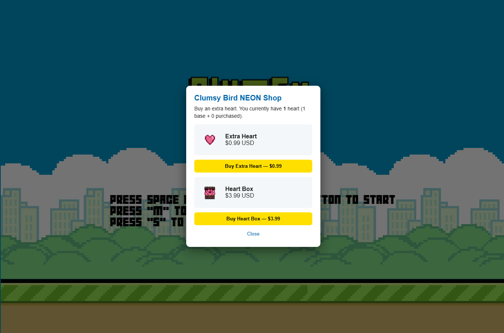

# Clumsy Bird with NEON


 

***

## 1. Game overview

Clumsy Bird with NEON is a side-scrolling one-tap game. The player taps **Space** (or clicks **left mouse button**) to flap, holding the bird in the air while avoiding pipes and the ground.

The game had one life before modification: collision to pipe or ground triggers Game Over.

***

## 2. How to run

### Prerequisites

- Node.js 18+
- `Neon Console`(<https://neonpay.com>) access with a sandbox API key
- `ngrok`(<https://ngrok.com/download>) account for exposing the local server to Neon
- A subdomain for `ngrok-free.dev`for webhook endpoint exposure

### Steps

1. **Register the webhook in Neon Console**
   - Go to your Neon Console → Webhooks.
   - Set the URL to `${PUBLIC_URL}/api/webhook` (e.g. `https://<your-subdomain>.ngrok-free.dev/api/webhook`).
   - Set the shared secret to the same value as `NEON_WEBHOOK_SECRET` in your `.env`
   - OR generate a new secret key in Neon Console and paste value to `NEON_WEBHOOK_SECRET` in your `.env`
2. **Install backend dependencies**
   ```powershell
   cd server
   npm install
   ```
3. **Configure environment**

   Copy `.env.example` to `.env` at the repo root and fill in:
   ```env
   NEON_API_KEY=pk_sandbox_…
   NEON_WEBHOOK_SECRET=<your-secret-key>

   PORT=3000
   PUBLIC_URL=https://<your-subdomain>.ngrok-free.dev

   IS_SANDBOX=true
   SANDBOX_IP=8.8.8.8
   SANDBOX_LOCALE=en-US
   ```
4. **Expose with ngrok**

   In a separate terminal:
   ```powershell
   ngrok http 3000 --url https://<your-subdomain>.ngrok-free.dev
   ```
5. **Start the backend**
   ```powershell
   cd server
   npm start
   ```
6. **Play**

   Open `http://localhost:3000/` in your browser. On the Title screen, press **S** to open the Shop. Click **Buy Extra Heart** or **Buy Heart Box** to open Neon's hosted checkout in a new tab.

***

## 3. New Features

### Game Server

- Express backend
- Maps for in-memory ledger of checkouts, purchases, and player state
- API route for getting localized pricing GET `/api/prices`
- API route for creating a new checkout POST `/api/checkout`
- API route for polling the checkout status GET `/api/checkout/:id`
- API route for expiring a checkout POST `/api/checkout/:id/expire`
- API route for getting entitlements GET `/api/entitlements/:accountId` (Not Neon API)
- Debug endpoint for inspection of in-memory ledgers GET `/_debug/state` (Not Neon API)

### Heart System

- Heart and Heart Box items
- Multi-life collision
- HUD for displaying heart count
- Handle entitlement local storage manipulation

### Purchase System

- Shop modal
- Display localized pricing (Turned off in Sandbox mode)
- Dynamic price update based on purchase history
- Cross-tab payment flow
- Checkout status polling
- Custom checkout timeout (5 minutes, ignore webhook checkout.abandoned)

***

## 4. Neon APIs

All calls go through the backend, never directly from the browser — the API key never leaves the server.

| API                       | Endpoint                                           |
| ------------------------- | -------------------------------------------------- |
| **Create Checkout**       | `POST https://api.neonpay.com/checkout`            |
| **Get Checkout**          | `GET https://api.neonpay.com/checkout/:id`         |
| **Expire Checkout**       | `POST https://api.neonpay.com/checkout/:id/expire` |
| **Get Localized Pricing** | `GET https://api.neonpay.com/prices?ip=<ip>`       |
| **Webhook**               | `POST <PUBLIC_URL>/api/webhook`                    |

***

## Notes / known limitations

- **In-memory ledger** is wiped on server restart. A real deployment should replace the `Map`s for `SQLite` or `Postgres`.
- **No retry/backoff on the GET poll**. A network blip is silently absorbed and the next tick tries again. After 5 minutes the modal times out and offers a Close button.

